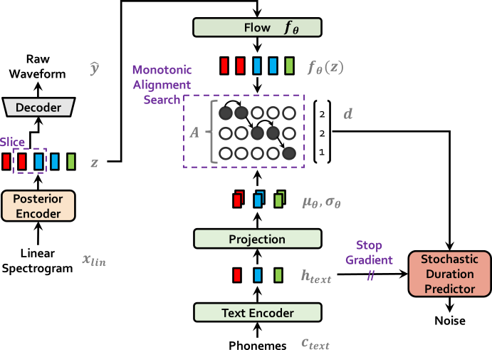

# SoftVC-VITS Voice (Singing) Conversion

## 模型简介

歌声音色转换模型，通过 `HuBERT soft content encoder` 内容编码器提取源音频语音特征，随后根据原始音频生成 `Coarse F0`
信号并将两者结合输入 VITS 以替换原本的文本输入达到歌声转换的效果。
> 该midi方案目前暂时搁置转入dev分支，目前模型修改回使用 [coarse F0输入](https://github.com/PlayVoice/VI-SVC/blob/main/svc/prepare/preprocess_wave.py)
，目前尝试使用[HarmoF0](https://github.com/wx-wei/harmof0) 来进行f0提取

**模型推理、训练、一键脚本汇总整理仓库 [sovits_guide](https://github.com/IceKyrin/sovits_guide)**

## 前置知识

### 1. [SoftVC](https://github.com/bshall/soft-vc)

SoftVC 是一个能够将语音转换为语音的模型，与本模型的功能基本上一致，但该模型的效果较差，会产生较为严重的电流声，因此无法直接使用。

该模型主要分为三个部分，本项目主要使用 [HuBERT content encoder](https://github.com/bshall/hubert)
编码器来实现语音转语素的功能，说人话就是去除音频中的个人音色、音调等等东西，只保留指导模型做最基础发音的特征向量。

1. [HuBERT content encoder](https://github.com/bshall/hubert)

   

   实际上 HuBERT content encoder 分为两种实现，一种是直接使用 **k**-means
   来得到离散语素单元，通过线性投影得到 `soft speech units` 后再生成离散语素单元。
2. [Acoustic Models](https://github.com/bshall/acoustic-model)
3. [HiFiGAN vocoder](https://github.com/bshall/hifigan)

由于本模型主要使用 SoftVC 中的 `HuBERT content encoder`，模型中的其他部分就不再赘述，请读者前往原项目查看代码和论文。

### 2. [VITS](https://github.com/jaywalnut310/vits)

`VITS: Conditional Variational Autoencoder with Adversarial Learning for End-to-End Text-to-Speech` 是一种端到端（硬
Train 一发文字到语音）的 TTS 模型，透过 VAE、HifiGAN
等技术，它能够通过用户输入的文字生成高质量的音频，值得注意的是，本模型也自带语音转换功能，但是，要实现该功能，需要同时输入转换者双方的大量音频数据集，因此在应用方面相较于本项目可能略差一些。

| Vits 模型训练                     | Vits 模型推理（生成）                 |
|-------------------------------|-------------------------------|
|  |  |

为了降低读者的理解门槛，这里可以直接将 VITS 认为是一个文字转语音的模型即可，不用太过深入地了解。

### 3. [Coarse F0](https://github.com/PlayVoice/VI-SVC/blob/main/svc/prepare/preprocess_wave.py)

基频(`F0`)是一种和音高(`Pitch`)高度相似的概念，你大概可以在本文中直接将其理解为音高，本文采用了 VI-SVC
中的现有实现来直接提取原音频中的音高数据用于引导模型产生的实际音频。

## 项目结构

## SoftVC-VITS 模型工作原理

TODO(可以先参考源码，源码已经高度注释)

## 如何训练模型？

### 数据文件结构与预处理

datasets 文件夹下包含各中数据集，其中
`f0` 文件夹包含音频基频描述文件（程序生成）
`sounds` 文件夹包含原始音频文件（用户放入）
`speech_units` 文件夹包含经过 Hubert 加码器加码的文件
根目录下在数据生成后会产生一个 txt 文件用于描述所有的数据

> IMPORTANT
>
> 通常，f0, sounds, speech_units 文件夹都以这个结构来组织数据

- f0
  - 1
  - 2
  - 3
  - ...
  - 8
- sounds
  - 1
  - 2
  - 3 
  - ...
  - 8
- speech_units
  - 1
  - 2
  - 3
  - ...
  - 8
- valid
  - f0
    - 1
    - 2
    - 3
    - ...
    - 8
  - sounds 
    - ...

  - speech_units
    - ...
  - nyarumul.txt
- nyarumul.txt
>
> 这当中，1、2、3 等文件架代表的是某一位歌手的 ID，例如，1的文件夹下应当放置歌手1的声音文件

要进行预处理，首先需要在 datasets/sounds 文件夹下建立子文件夹，举个例子，我如果有两位歌手，则需要新建如下文件夹并放入数据:
- sounds
  - 1
    - name1.wav
    - name2.wav
  - 2
    - 114514.wav
    - jumpstar.wav

同理可得，如果我有三位歌手的数据，那么我需要新建如下文件夹并放入数据
- sounds
  - 1
    - aaa.wav
    - bbb.wav
  - 2
    - wwwa.wav
    - ccad.wav
  - 3
    - blender.wav
    - c4d.wav
    - minecraft.wav

目前，数据预处理器只支持最多 `8` 位歌手的数据同时存在，当前版本也没有支持单人数据训练，这主要是因为通常情况下，单人模型的效果并不好，我们总是推荐使用
2 人以上的音频数据用于训练。

在完成上述的操作后就可以调用 preprocess_wave.py 文件进行数据处理了

> IMPORTANT
>
> 我们总是推荐你先使用 virtualenv 建立子 Python 环境后再安装相关依赖，如果可能的话，请新建 virtualenv 后再执行下列操作


要开始处理？请首先使用指令

```shell
pip install -r requirements.txt
```

以安装依赖，在依赖安装完成后，请使用

```shell
python preprocess_wave.py -pa true
```

以启动相关数据处理单元，这其中包含 f0 生成、hubert
生成以及一些额外数据的生成，当然，该工具也准备了一些命令行参数用于调整功能，通常情况下你不需要使用这些东西，不过为了防止特殊情况出现，我们还是将这些指令列表如下：
> IMPORTANT
>
> 在运行该脚本的时候，您可能遇到的问题 99% 都是网络造成的，推荐使用科学上网方法后增加 -p 参数以提高下载 HuBERT 模型的成功率
>
> 通常，对于某个小猫咪软件，我们可以使用 -p http://localhost:7890 来为我们的脚本设置使用小猫咪的代理
>
> 我们给出一个常用的范例启动训练指令
> ```shell
> python preprocess_wave.py -p http://localhost:7890 -pa true
> ```
> 请确定小猫咪是使用了 http 方式来辅助我们的脚本访问网络，通常情况下，小猫咪提供的是 Socks + HTTP 混合端口，这种端口不确定是否能够为
> Requests 包提供连接，如果出现问题，请手动声明 http 端口来为脚本提供代理

| 参数   | 参数功能                          | 范例                       | 默认值   |
|------|-------------------------------|--------------------------|-------|
| -s   | 指定输入音频目录                      | ./datasets/sounds        | 同范例   |
| -f   | 指定 F0 输出目录                    | ./datasets/f0            | 同范例   |
| -u   | 指定 HuBERT 输出目录                | ./datasets/speech_units  | 同范例   |
| -c   | 指定模型配置文件位置                    | ./configs/nyarumul.json  | 同范例   |
| -d   | 指定数据描述文件存储位置                  | ./datasets/nyarumul.txt  | 同范例   |
| -p   | 指定是否使用代理来下载 HuBERT 模型         | http(s)://localhost:7891 | 空白字符串 |
| -t   | 指定验证集存放位置                     | ./datasets/valid         | 同范例   |
| - pa | 是否自动分离测试集（如果是第一次使用通常可以打开这个选项） | true                     | false |

在执行完上述指令后，你应该能够发现 `datasets` 文件夹中 `f0`, `sounds` 和 `speech_units`多了很多的数据文件，并且 `datasets`
目录下出现了 txt 描述文件，恭喜您，这时数据已经准备就绪，我们可以进行模型的训练了！

### 训练模型指令

在完成上一步的数据集生成后，可以通过指令开始模型的训练，模型训练的指令如下:

```shell
python train_ms.py -c ./configs/nyarumul.json -m Nyarumul
```

其中 -c ./configs/nyarumul.json 可以更改为自定义的配置文件路径，-m Nyarumul 则是训练的目标模型的名称。

nyarumul.json 文件结构如下，需要关注的主要是 `training_files` 和 `validation_files` 字段

```json
{
  "train": {
    "log_interval": 200,
    "eval_interval": 2000,
    "seed": 1234,
    "epochs": 10000,
    "learning_rate": 2e-4,
    "betas": [
      0.8,
      0.99
    ],
    "eps": 1e-9,
    "batch_size": 8,
    "fp16_run": true,
    "lr_decay": 0.999875,
    "segment_size": 8192,
    "init_lr_ratio": 1,
    "warmup_epochs": 0,
    "c_mel": 45,
    "c_kl": 1.0
  },
  "data": {
    "//training_files": "指定训练文件索引，也就是上文中生成的训练用 txt 文件",
    "training_files": "./datasets/nyarumul.txt",
    "//validation_files": "指定测试文件索引，也就是上文中生成的测试用 txt 文件",
    "validation_files": "./datasets/valid/nyarumul.txt",
    "text_cleaners": [
      "english_cleaners2"
    ],
    "max_wav_value": 32768.0,
    "sampling_rate": 22050,
    "filter_length": 1024,
    "hop_length": 256,
    "win_length": 1024,
    "n_mel_channels": 80,
    "mel_fmin": 0.0,
    "mel_fmax": null,
    "add_blank": true,
    "n_speakers": 2,
    "cleaned_text": true,
    "train_data_shuffle_seed": 1234
  },
  "model": {
    "inter_channels": 192,
    "hidden_channels": 256,
    "filter_channels": 768,
    "n_heads": 2,
    "n_layers": 6,
    "kernel_size": 3,
    "p_dropout": 0.1,
    "resblock": "1",
    "resblock_kernel_sizes": [
      3,
      7,
      11
    ],
    "resblock_dilation_sizes": [
      [
        1,
        3,
        5
      ],
      [
        1,
        3,
        5
      ],
      [
        1,
        3,
        5
      ]
    ],
    "upsample_rates": [
      8,
      8,
      2,
      2
    ],
    "upsample_initial_channel": 512,
    "upsample_kernel_sizes": [
      16,
      16,
      4,
      4
    ],
    "n_layers_q": 3,
    "use_spectral_norm": false,
    "gin_channels": 256
  }
}
```

训练中的模型将会被存放在 ./logs/模型名称 的文件夹当中，请妥善保管该文件夹。 `数据无价，谨慎操作`

### 模型的 checkpoint 与断点重训

模型具有 checkpoint 功能，这也就意味着你可以在训练一段时间后停止，只需在模型文件夹（`./logs/模型名称`) 中具有 `G_*.pth`
、 `D_*.pth` 和 `config.json` 就可以在之前的基础上继续训练，值得注意的是，模型将会采用具有最大数字的 `pth`
文件作为训练起始，举个例子 `G_100.pth` 和 `G_99.pth`，模型将会采用 `G_100.pth`
作为训练起点继续在此基础上迭代并产出 `G_101.pth` 等等新的权重和模型状态数据。

## 如何使用模型？
### 载入模型参数和权值以进行输出
TODO
### 如何使用 VST 插件来和 Studio One 等机架通信以达到实时效果
TODO

> PS
> + midi note（0-127 LongTensor）通过pitch_embedding后与soft-units相加替代vits原本的文本输入
> + 使用midi而非f0似乎会导致模型音高不准 目前修改回使用F0
> + 采用了VISinger中的PitchPredictor，引入了PitchLoss修正音高
> + 似乎效果不是很明显，或许加的方式不太对
  
