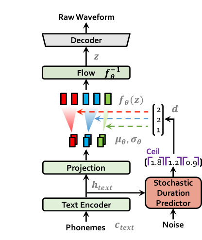

# SoftVC-VITS Voice (Singing) Conversion
## 模型简介
歌声音色转换模型，通过 `HuBERT soft content encoder` 内容编码器提取源音频语音特征，随后根据原始音频生成 `Coarse F0` 信号并将两者结合输入 VITS 以替换原本的文本输入达到歌声转换的效果。
> 该midi方案目前暂时搁置转入dev分支，目前模型修改回使用 [coarse F0输入](https://github.com/PlayVoice/VI-SVC/blob/main/svc/prepare/preprocess_wave.py) ，目前尝试使用[HarmoF0](https://github.com/wx-wei/harmof0) 来进行f0提取

模型推理、训练、一键脚本汇总整理仓库 [sovits_guide](https://github.com/IceKyrin/sovits_guide)
## 前置知识
### 1. [SoftVC](https://github.com/bshall/soft-vc)
SoftVC 是一个能够将语音转换为语音的模型，与本模型的功能基本上一致，但该模型的效果较差，会产生较为严重的电流声，因此无法直接使用。

该模型主要分为三个部分，本项目主要使用 [HuBERT content encoder](https://github.com/bshall/hubert) 编码器来实现语音转语素的功能。
1. [HuBERT content encoder](https://github.com/bshall/hubert)

    
    
    实际上 HuBERT content encoder 分为两种实现，一种是直接使用 **k**-means 来得到离散语素单元，通过线性投影得到 `soft speech units` 后再生成离散语素单元。
2. [Acoustic Models](https://github.com/bshall/acoustic-model)
3. [HiFiGAN vocoder](https://github.com/bshall/hifigan)

由于本模型主要使用 SoftVC 中的 `HuBERT content encoder`，模型中的其他部分就不再赘述，请读者前往原项目查看代码和论文。
### 2. [VITS](https://github.com/jaywalnut310/vits)
`VITS: Conditional Variational Autoencoder with Adversarial Learning for End-to-End Text-to-Speech` 是一种端到端（硬 Train 一发文字到语音）的 TTS 模型，透过 VAE、HifiGAN 等技术，它能够通过用户输入的文字生成高质量的音频，值得注意的是，本模型也自带语音转换功能，但是，要实现该功能，需要同时输入转换者双方的大量音频数据集，因此在引用方面相较于本项目可能略差一些。

| Vits 模型训练                     | Vits 模型推理（生成）                 |
|-------------------------------|-------------------------------|
|  |  |

为了降低读者的理解门槛，这里可以直接将 VITS 认为是一个文字转语音的模型即可，不用太过深入地了解。
### 3. [Coarse F0](https://github.com/PlayVoice/VI-SVC/blob/main/svc/prepare/preprocess_wave.py)
基频(`F0`)是一种和音高(`Pitch`)高度相似的概念，你大概可以在本文中直接将其理解为音高，本文采用了 VI-SVC 中的现有实现来直接提取原音频中的音高数据用于引导模型产生的实际音频。
## 项目结构
## SoftVC-VITS 模型工作原理
TODO(可以先参考源码，源码已经高度注释)
## 如何训练模型？
### 训练数据文件结构
TODO
### 训练模型指令
TODO
### 模型的 checkpoint 与断点重训
TODO
## 如何使用模型？
### 载入模型参数和权值
TODO
> PS
> + midi note（0-127 LongTensor）通过pitch_embedding后与soft-units相加替代vits原本的文本输入
> + 使用midi而非f0似乎会导致模型音高不准 目前修改回使用F0
> + 采用了VISinger中的PitchPredictor，引入了PitchLoss修正音高
> + 似乎效果不是很明显，或许加的方式不太对
  
