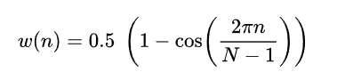

# 时频谱
时频谱（英语：Spectrogram）又称声谱图（voicegram），是一种描述波动的各频率成分如何随时间变化的热图。利用傅里叶变换得到的传统的2维频谱可展示复杂的波动是如何按比例分解为简单波的叠加（分解为频谱），但是无法同时体现它们随时间的变化。能对波动的时间变量与频率分布同时进行分析的常用数学方法是短时距傅里叶变换，但是直接绘成3维图像的话又不便于在纸面上观察和分析。时频谱在借助时频分析方法的基础上，以热图的形式将第3维的数值用颜色的深浅加以呈现。[Wikipedia](https://zh.wikipedia.org/zh-cn/%E6%97%B6%E9%A2%91%E8%B0%B1)


## NFFT，HOP LENGTH
在计算短时傅里叶变换的时候，你需要首先为一些很小的片段计算 `FFT（快速傅里叶变化）`。这些小的片段的长度就是我们模型中所谓的参数 `n_fft(filter_length)`，通常这些小片段都会互相重叠（这主要是为了防止信息丢失），所以，两个片段之间的距离通常不会被设置为 `n_fft`，一般却被设置为更小的量，比如 `n_fft / 2`，也就是我们模型配置文件中的 `hop_length`。

所以，如果你有 1000 个音频的采样点，`hop_length` 是 100，你会大概得到 10 个特征帧（大多数情况下， `n_fft` 比 `hop_length` 还要大，你可能就需要在样本两头做 padding 了）。

举个例子，如果使用 512 的 `hop_length`，音频采样率在 22050 Hz，你得到特征帧的频率大概在
```python
sample_rate = 22050
hop_length = 512
# 结果是 43 Hz
frame_rate = sample_rate / hop_length
```
当然，Padding 操作会使这个结果有一些微小的变化

如果你想对时频谱有更深入的了解，可以观看视频
[Spectrogram Examples (Python)](https://www.youtube.com/watch?v=TJGlxdW7Fb4)

## HANN WINDOW
在数字信号处理中，有一种除了给定区间之外的取值均为0的函数，这个函数被形象地成为矩形窗。除了矩形窗以外，还有相当多其他的窗函数，而模型中的 win_length 配置文件就配置了数据预处理时 HANN 窗的长度。


HANN 窗又被成为升馀弦窗，可以看作是3个矩形时间的频谱之和，或者说 3 个 sinc(t) 函数和，而括号中的两项相对于第一个谱窗向左、右各移动了π/T，从而使旁瓣互相抵消，消去高频干扰和漏能。

从减小泄漏观点出发，Hann窗优于矩形窗。但Hann窗主瓣加宽，相当于分析带宽加宽，频率分辨力下降。